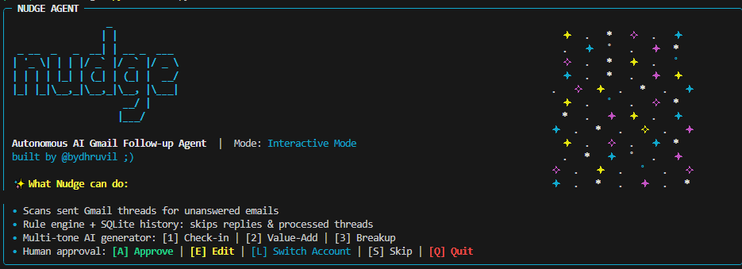

# 🚀 Nudge — Autonomous AI Gmail Follow-up Agent

[](https://pypi.org/project/nudge-agent)
[](https://pypi.org/project/nudge-agent)
[](https://github.com/dhruvil-codes/nudge-agent/blob/main/LICENSE)
[](https://github.com/dhruvil-codes/nudge-agent)

**Nudge** is an intelligent, zero-setup CLI agent that audits your sent Gmail threads, identifies unanswered emails, and generates short, natural human follow-up replies using **Groq AI (Llama 3.3 70B)**.

Designed for job hunters, founders, recruiters, and sales teams who want to follow up fast without writing generic AI fluff.

---



---

## ✨ Features

- 🔑 **0-Setup Google OAuth**: No Google Cloud Console setup or `credentials.json` required! Sign in via Google in 5 seconds.
- 🗄️ **SQLite History Persistence (`~/.nudge/history.db`)**: Remembers drafted and skipped threads so you never get prompted twice for the same email.
- 📧 **Full Email MIME Context**: Reads full thread history instead of short snippets for deeply contextual follow-ups.
- 🎭 **Interactive Multi-Tone AI Generator**:
  - `[1] Check-in`: Quick, warm status update request.
  - `[2] Value-Add`: Shares project accomplishments or progress updates.
  - `[3] Breakup`: Sends a polite final note to give the recipient a low-pressure way to respond.
- 🧠 **Smart Decision Engine**:
  - Skips threads where the recipient already replied.
  - Skips threads sent `< 3 days` ago.
  - Skips threads where you've already sent `2+` follow-ups.
- ⌨️ **Single Keypress CLI Control**: Approve (`[A]`), Edit (`[E]`), Change Tone (`[1]`, `[2]`, `[3]`), Switch Account (`[L]`), Skip (`[S]`), or Quit (`[Q]`).

---

## ⚡ Instant Installation

Install Nudge globally via `pip` or `pipx`:

```bash
pip install nudge-agent
```

Then run `nudge` anywhere in your terminal:

```bash
nudge
```

---

## ⚙️ Environment Configuration

Set your **Groq API Key** in your `.env` file or export it in your terminal environment:

```bash
export GROQ_API_KEY="gsk_your_groq_api_key_here"
```

Nudge also automatically loads configuration from `~/.nudge/.env` if present.

---

## 💻 CLI Usage Options

```bash
nudge [OPTIONS]
```

| Flag | Description |
| :--- | :--- |
| `--limit <N>` | Number of sent Gmail threads to scan (Default: 50) |
| `--auto` | Auto-approve mode (creates drafts without interactive prompts) |
| `--login` | Force Google re-authentication to sign in with a new Gmail account |
| `--logout` | Log out of your current Gmail account |
| `-h, --help` | Show command help and options |

---

## 🛠 Architecture

```text
nudge/
├── main.py             # Rich TUI Orchestrator & interactive keypress approval loop
├── gmail_client.py     # Gmail API authentication, MIME body parser & SQLite history DB
├── followup_agent.py   # Decision engine & Groq Llama 3.3 70B prompt generator
└── pyproject.toml      # Packaging metadata & entrypoints
```

---

## 🔒 Privacy & Security

* **Local Storage**: Your Google token (`token.json`), SQLite database (`history.db`), and local state are stored **100% locally on your computer** inside `~/.nudge/`.
* **Draft Mode Guarantee**: Nudge attaches approved replies as **drafts** inside your Gmail account so you maintain 100% control before sending.

---

## 👤 Author & License

Built by [@bydhruvil](https://github.com/dhruvil-codes) ;)

Licensed under the [MIT License](LICENSE).
